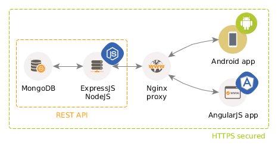

# taskback

**taskback** is a simple MEAN stack platform to manage personal TODO and task lists. You can check the [list of features](#features) to get a better idea of what it does.

#### But... Why?

There are tons of apps and services to manage TODO lists, tasks and information lists. I know that. I use some of them, but none have proven to be flexible and light-weight enough for my needs. Besides, no task management service or app supports [Gingerbread](http://developer.android.com/about/dashboards/index.html#Platform) anymore, even though we are still quite a lot of users out there, so this is a way to keep my device running this kind of application.

And it is indeed for fun. And learning, mostly learning.

#### The ecosystem

The Taskback ecosystem consists of the following pieces: a MongoDB database, a NodeJS server (using ExpressJS as the web framework of choice), an AngularJS web app and a native Android app.



## Documentation

*Disclaimer: I find convenient to document things that might seem obvious for other people, because I am not a senior developer and because I tend to forget what I did in my projects after a week.*

* Technical documentation regarding the **infrastructure**, **deployment** or internal structure of the web server can be found in the [Developer Manual](docs/dev-manual.md).
* The Taskback [REST API documentation](docs/api/api.md) is separated from the rest of the docs to isolate the conceptual details of the service from the implementation details.

#### Documentation generation

The [Developer Manual](docs/dev-manual.md) is generated from smaller "modules" (documents), using the awesome [markdown-include](https://github.com/sethen/markdown-include) node.js-based CLI tool. It can be found in the [NPM repository](https://www.npmjs.com/package/markdown-include) and installed as a global package by executing: `sudo npm install -g markdown-include`.

To generate the Manual, execute:

```bash
markdown-include docs/documentation.json
```

in the root of the project, where `documentation.json` is the configuration file used by the tool to wire up all the components and generate the table of contents as well. Actually, the only file being processed by `markdown-include` is `docs/_index.md`, which contains all the necessary documentation files inclusions, in the form of `#include docs/infrastructure/database.md`, for example.

## Features

**Work in progress!**

The following is a high-level overview of the platform features (use cases, from the user's point of view):

* TODO list
  * Create a simple TODO
    * Define title
    * Assign priority
    * Optionally, add due date
  * View the list of TODOs
  * Complete (delete) a TODO
* Tasks list
  * Create a "complex" task with
    * Title
    * Priority (optional)
    * Description (optional)
    * Category (optional)
    * Due date (optional)
    * Checklist (optional)
  * View the list of tasks
    * Filter/order by category/priority
  * Complete a task
* Shop list
  * Create a shop list item (just a title)
  * Archive an item (on completion, by default)
  * Delete an item

## [License](LICENSE)

Taskback is [FOSS](https://en.wikipedia.org/wiki/Free_and_open-source_software)! It is licensed with a MIT [permissive license](https://en.wikipedia.org/wiki/Permissive_free_software_licence). See the [license document](LICENSE) for more information.
