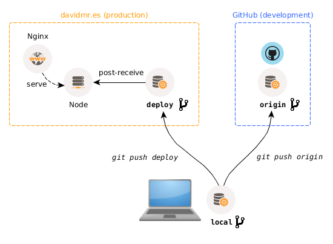

# Table of Contents

1. [Infrastructure](#infrastructure)
  1. [Nginx](#nginx)
  1. [Node](#node)
  1. [Security](#security)
  1. [MongoDB](#mongodb)
  1. [Deployment](#deployment)
1. [The Taskback server](#the-taskback-server)
  1. [Logger](#logger)
  1. [Internal Module Requires](#internal-module-requires)


# WORK IN PROGRESS

**This is just a documentation test file to see if the framework works!**

# Infrastructure

Informally, the Taskback platform infrastructure can be described by the following diagram:


The following subsections deal with the details of each of the pieces of this infrastructure, from installation to configuration.

> **NOTE:** All of the instructions provided assume that the target environment is a working Ubuntu 14.04 LTS Linux, where the user is not `root`, but has `sudo` privileges nontheless.

## Nginx
[Nginx](http://nginx.org/) is one of the [most popular web servers](https://en.wikipedia.org/wiki/Web_server#Market_share) in the world and is responsible for hosting some of the largest and highest-traffic sites on the internet. It is more resource-friendly than Apache in most cases and can be used as a web server or a **reverse proxy**. An important concept to be noted about Nginx is that it works on a configuration file basis.

### Installation

```
sudo apt-get update
sudo apt-get install nginx
```

### Nginx process management

A series of commands are used to interact with the Nginx process, which runs as an init.d service.

```
sudo service nginx start
sudo service nginx reload   #reload config
sudo service nginx restart  #restart *completely*
sudo service nginx status   #tell if it's running
sudo service nginx stop
```

This commands can be useful when loading a new configuration after a new service is setup or the parameters for one of them change.

### Configuration

The configuration files of Nginx are located at `/etc/nginx`. There are three important items under this directory:

* `nginx.conf` is the main Nginx configuration file, holding shared (between the proxied servers) feature settings such as logging, gzip-ing of responses, etc.
* `sites-available/` contains the config files for all the services we want to define.
* `sites-enabled/` contains symlinks (`ln -s TARGET LINK_NAME`) for the service definitions in `sites-available` that we actually want to expose (proxy) through Nginx.

Therefore, if we want to setup a new service, we will write its definition file in `sites-available` and then create a symlink pointing to it in `sites-enabled`. Later on, we will `reload` (or `restart`) the `nginx` service to make it aware of the changes.

#### HTTPS configuration

All Taskback traffic is protected by encrypting the traffic from the front-end clients (the Angular and Android apps) to Nginx using HTTPS (the traffic between Nginx and Node os not protected, easing the development of the Node.js server). To do so, we need a certificate and a proper configuration of the reverse proxy.

> **NOTE:** HTTPS secured traffic is not the only security feature of Taskback. Check the [Security section](#security) below for the rest of the implemented mechanisms.

> **NOTE:** The following procedure is explained in more detail in a [DigitalOcean tutorial](https://www.digitalocean.com/community/tutorials/how-to-create-an-ssl-certificate-on-nginx-for-ubuntu-14-04).

To generate a [self-signed certificate](https://en.wikipedia.org/wiki/Self-signed_certificate) with an expiration date of 1 year in advance, we will execute:

```
sudo mkdir /etc/nginx/ssl
sudo openssl req -x509 -nodes -days 365 -newkey rsa:2048 -keyout /etc/nginx/ssl/taskback.key -out /etc/nginx/ssl/taskback.crt
```

The rest of the configuration is provided in the specific config files (see below).

#### Config files

The configuration needed to run Taskback consists of its own `server` block definitions in the `/etc/nginx/sites-available/taskback.conf` file and some modifications to the global `nginx.conf` file.

The following `server` block is used to avoid unsecured HTTP traffic, by redirecting it to HTTPS:

```
server {
  listen 80;                                   # listen to HTTP,
  server_name taskback.example.com;            # in this domain
  return 301 https://$server_name$request_uri; # and redirect *permanently* (301)
}
```

The actual proxy redirection to the Node.js back end is performed by the next `server` block:

```
server {
  listen 443 ssl;                             # listen to HTTPS,
  server_name         taskback.example.com;   # in this domain

  ssl_certificate     /etc/nginx/ssl/taskback.crt;
  ssl_certificate_key /etc/nginx/ssl/taskback.key;
  ssl_protocols       TLSv1 TLSv1.1 TLSv1.2;  # do not allow for SSL! It is not secure!
  add_header Strict-Transport-Security "max-age=31536000" always;

  location / {
    proxy_set_header X-Real-IP $remote_addr;
    proxy_set_header X-Forwarded-For $proxy_add_x_forwarded_for;
    proxy_set_header X-Forwarded-Proto $scheme;
    proxy_pass http://localhost:PORT;        # where PORT is the actual Node.js TCP port
  }
}
```


## Node
[Node](https://nodejs.org) is the back end server of choice for Taskback for a number of reasons: (a) because of the use of Javascript, it is really fast to develop a service that works with JSON natively, (b) I want to learn Javascript, (c) integration with MongoDB is really simple, (d) it is fast, (e) the asynchronous paradigm behind Node is very interesting and worthy to be learned.

> **NOTE:** The particular details about the server development are explained in the [Taskback server](#the-taskback-server) section, below. The following subsections cover the installation process and some basics about Node's environment.


### Installation

```
sudo apt-get update
sudo apt-get install nodejs
```

### Package file

The `package.json` file contains the metadata, dependencies and other items about the developed "package", this is, the server. Dependencies are indeed other Node packages (modules) that are added as libraries to the project (see *Node modules* below). An incomplete version of the `package.json` file could be the following one:

```json
{
  "name": "taskback",
  "version": "1.0.0-alpha",
  "description": "A simple MEAN stack platform to manage personal tasks and TODO lists",
  "main": "server.js",
  "scripts": {...},
  "repository": {...},
  "keywords": [...],
  "author": "necavit (David Martínez Rodríguez)",
  "license": "MIT",
  "bugs": {"url": "https://github.com/necavit/taskback/issues"},
  "homepage": "https://github.com/necavit/taskback#readme",
  "engines": {"node": "4.3.1"},
  "dependencies": {...}
}
```

### Node modules, NPM

The Node ecosystem is very rich and consists of thousands of packages that can be accessed using the native [Node Package Manager](https://www.npmjs.com) (NPM). To add a module as a dependency to the project, execute:

```
npm install [-g] PACKAGE_NAME [--save|--save-dev]
```

The `-g` switch will install the package globally, thus being accessible from any Node project (useful for Node-based CLI tools). The `--save` and `--save-dev` are used to include them in the `package.json` file, either as production or development dependencies (for testing purposes, for example).

> **NOTE:** it is important to use the `--save` switches, so that when the project is checked out from the repository (either in a new dev machine or in production), a simple `$> npm install` command issued at the root of the project will download and install the proper dependencies.


## Security
Taskback is secured using a number of standard schemes, which are explained in the subsections below.

### Firewall

The machine hosting the Taskback back end stack uses the [ufw](https://wiki.ubuntu.com/UncomplicatedFirewall) firewall to block all connections to ports/protocol-port that are not explicitly allowed. The only available ports are:

* `80/tcp`: to access the rest of the web services (static pages) provided by the host under normal HTTP.
* `443/tcp`: to access the Taskback server under HTTPS (TLS).

To check the status of the firewall, issue the command:

```
sudo ufw status
```

### HTTPS

All traffic between the clients and the Taskback server is encrypted over the TLS transport, using a self-signed certificate. Clients should be aware of the fact that this certificate will not be recognized by the standard libraries of the underlying systems (particularly in the case of Android).

The generation, installation and use of the SSL certificate was already covered in the [Nginx](#nginx) section.

### API keys and tokens

**Work in progress!**


## MongoDB
**Work in progress!**

The database that `taskback` is using is [MongoDB](https://www.mongodb.org/)


## Deployment
**Work in progress!**

The deployment of the Taskback server is done using a [bare Git repository](http://stackoverflow.com/a/7861254) together with a [`post-receive` Git hook](http://git-scm.com/book/en/v2/Customizing-Git-Git-Hooks). The following diagram illustrates the deployment process.



### Git deployment repository

Besides the GitHub repository hosting all the code and development branches, a "server-side" repository is hosted at the production machine. Whenever a new release is to be rolled out, a simple

```
git push deploy master
```

command will push the `master` branch to the bare `deploy` [remote](https://git-scm.com/book/en/v2/Git-Basics-Working-with-Remotes), triggering a `post-receive` hook, which takes care of actually copying the updated code to the staging directory from which it is served by the Nginx proxy.

#### Bare repository setup

To create the `deploy` remote repository, ssh' into the deployment machine and issue the following commands:

```
mkdir ~/taskback.git && cd ~/taskback.git
git init --bare
```

The `--bare` switch indicates that the repository folder will not contain a working tree (no files, just source control).

After creating the repository, go back to your local development machine and add the new remote (in the local repository folder):

```
git remote add deploy ssh://user@mydomain.com/home/user/taskback.git
```

#### post-receive Git hook

In order to deploy the files from the bare repository, once a new `push` is received, a simple Bash script named `post-receive` has to be placed under the `hooks` directory in the Git repository. (Remember to `chmod +x` the script!)

```bash
#!/bin/bash -l

# NOTE: this git hook is meant to be installed in the deployment remote repository

# checks out the latest changes into the staging directory (PUBLIC_WWW) and builds
#  (npm install) the server. If no instance is already running, it is started with
#  the 'forever' utility. If an instance is running, all forever jobs are restarted

GIT_REPO=$HOME/taskback.git
PUBLIC_WWW=/data/web/taskback

git --work-tree=$PUBLIC_WWW --git-dir=$GIT_REPO checkout -f
pushd $PUBLIC_WWW
npm install
forever_command="restartall"
if forever list | grep -q "No forever processes running"; then
  forever_command="start server.js";
fi
NODE_ENV=production forever $forever_command
popd
exit
```

### Forever

Noticed the use of `forever` in the previous Git hook script? `forever` is a simple CLI tool for ensuring that a given Node script runs continuously. It can be installed using the NPM:

```
npm install -g forever
```

### Not everything is automated

Please note that not all of the deployment process is automated. If there were changes in the Nginx configuration or in the production environment properties file (a file that is ignored in the source control), these would have to be manually copied and taken care of.

A simple, local, `pre-push` Git hook can remind us of this situation whenever we are pushing to the `deploy` remote:

```bash
#!/bin/bash -l

# NOTE: this git hook is meant to be installed in the local development repository

# checks the remote to which the commit is going to be pushed and
#  warns to check the production properties file if the remote is the
#  deploy repository

red=`tput setaf 1`
reset=`tput sgr0`

if [ "$1" == "deploy" ]; then
  echo ""
  echo "${red}!!!! DEPLOYING SERVER TO PRODUCTION !!!!"
  echo ""
  echo "If there are any changes, remember to:"
  echo "   - Remote copy the production properties file."
  echo "   - Copy nginx config files, update values and restart nginx accordingly."
  echo "${reset}"
  echo ""
fi
```


# The Taskback server

The following sections cover not the features implementation details, but some of the inner mechanisms and particular developments of the Taskback node.js server.

## Logger


## Internal Module Requires

