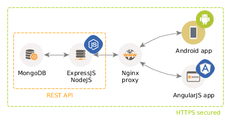

# Table of Contents

1. [Infrastructure](#infrastructure)
  1. [Nginx](#nginx)
  1. [Node](#node)
  1. [Security](#security)
  1. [MongoDB](#mongodb)
1. [Database](#database)
  1. [Deployment](#deployment)
1. [Deployment](#deployment)
1. [The Taskback server](#the-taskback-server)
  1. [Logger](#logger)
  1. [Internal Module Requires](#internal-module-requires)


# WORK IN PROGRESS

**This is just a documentation test file to see if the framework works!**

# Infrastructure

Informally, the Taskback platform infrastructure can be described by the following diagram:



The following subsections deal with the details of each of the pieces of this infrastructure, from installation to configuration.

> **NOTE:** All of the instructions provided assume that the target environment is a working Ubuntu 14.04 LTS Linux, where the user is not `root`, but has `sudo` privileges nontheless.

## Nginx
[Nginx](http://nginx.org/) is one of the [most popular web servers](https://en.wikipedia.org/wiki/Web_server#Market_share) in the world and is responsible for hosting some of the largest and highest-traffic sites on the internet. It is more resource-friendly than Apache in most cases and can be used as a web server or a **reverse proxy**.

An important concept to be noted about Nginx is that it works on a configuration file basis. This means that there is, hopefully, no module coding, but just configuration.

### Installation

```
sudo apt-get update
sudo apt-get install nginx
```

### Nginx process management

A series of commands are used to interact with the Nginx process, which runs as an init.d service.

```
sudo service nginx start
sudo service nginx restart
sudo service nginx stop
```

This commands can be useful when loading a new configuration after a new service is setup or the parameters for one of them change.

### Configuration

The configuration files of Nginx are located at `/etc/nginx`. There are three important items under this directory:

* `nginx.conf` is the main Nginx configuration file, holding shared (between the proxied servers) feature settings such as logging, gzip-ing of responses, etc.
* `sites-available/` contains the config files for all the services we want to define.
* `sites-enabled/` contains symlinks (`ln -s TARGET LINK_NAME`) for the service definitions in `sites-available` that we actually want to expose (proxy) through Nginx.

If we want to setup a new service, we will write its definition file in `sites-available` and then create a symlink pointing to it in `sites-enabled`. Later on, we will `restart` the `nginx` service to make it aware of the changes.

#### HTTPS configuration

All Taskback traffic is protected by encrypting the traffic from the front-end clients (the Angular and Android apps) to Nginx using HTTPS (the traffic between Nginx and Node os not protected, easing the development of the Node.js server). To do so, we need a certificate and a proper configuration of the reverse proxy.

> **NOTE:** HTTPS secured traffic is not the only security feature of Taskback. Check the [Security section](#security) below for the rest of the implemented mechanisms.

> **NOTE:** The following procedure is explained in more detail in a [DigitalOcean tutorial](https://www.digitalocean.com/community/tutorials/how-to-create-an-ssl-certificate-on-nginx-for-ubuntu-14-04).

To generate a [self-signed certificate](https://en.wikipedia.org/wiki/Self-signed_certificate) with an expiration date of 1 year in advance, we will execute:

```
sudo mkdir /etc/nginx/ssl
sudo openssl req -x509 -nodes -days 365 -newkey rsa:2048 -keyout /etc/nginx/ssl/taskback.key -out /etc/nginx/ssl/taskback.crt
```

The rest of the configuration is provided in the specific config files (see below).

#### Config files

The configuration needed to run Taskback consists of its own `server` block definition and some modifications to `nginx.conf`.

`/etc/nginx/nginx.conf`
```
user www-data;
worker_processes 4;
pid /run/nginx.pid;

events {
	worker_connections 768;
	# multi_accept on;
}

http {

	##
	# Basic Settings
	##

	sendfile on;
	tcp_nopush on;
	tcp_nodelay on;
	keepalive_timeout 65;
	types_hash_max_size 2048;
	# server_tokens off;

	server_names_hash_bucket_size 64;
	# server_name_in_redirect off;

	include /etc/nginx/mime.types;
	default_type application/octet-stream;

	##
	# Logging Settings
	##

	access_log /var/log/nginx/access.log;
	error_log /var/log/nginx/error.log;

	##
	# Gzip Settings
	##

	gzip on;
	gzip_disable "msie6";

	# gzip_vary on;
	# gzip_proxied any;
	# gzip_comp_level 6;
	# gzip_buffers 16 8k;
	# gzip_http_version 1.1;
	# gzip_types text/plain text/css application/json application/x-javascript text/xml application/xml application/xml+rss text/javascript;

	##
	# Virtual Host Configs
	##

	include /etc/nginx/conf.d/*.conf;
	include /etc/nginx/sites-enabled/*;
}
```

`/etc/nginx/sites-available/taskback.conf`
```
```


## Node


## Security
**Work in progress!**


## MongoDB
# Database

The database that `taskback` is using is [MongoDB](https://www.mongodb.org/)


## Deployment
# Deployment

To deploy the server into production, just execute:

```bash
git push deploy master
```
And you are done!


# The Taskback server

The following sections cover not the features implementation details, but some of the inner mechanisms and particular developments of the Taskback node.js server.

## Logger


## Internal Module Requires

